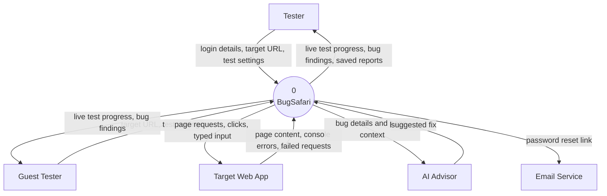

# Data Flow Diagram: Level 0 (Context Diagram)

## What this shows

This is the highest level view of BugSafari. The whole system is drawn as a single
process, and everything outside it is drawn as an external entity. The point of this
diagram is to show what enters the system and what leaves it, without saying anything
about how the work is done inside.

BugSafari has five external entities. Two of them are people, one is the website being
tested, and two are outside services the system calls when it needs them.

## Diagram

## External entities

| Entity | What it is | Why it is outside the system |
| --- | --- | --- |
| Tester | A registered user who signs in, starts test runs, and reviews saved reports | The person using BugSafari, not part of it |
| Guest Tester | A visitor who runs a test without signing up | Same role as a Tester, but nothing is saved for them |
| Target Web App | The website the tester wants checked | Owned by someone else; BugSafari only visits it |
| AI Advisor | Google Gemini, asked for a written fix suggestion | A paid service outside the codebase |
| Email Service | An SMTP mail server | Only used to deliver password reset links |

## Main data flows

| Flow | Direction | Meaning |
| --- | --- | --- |
| Login details | Tester to system | Email and password, exchanged for a sign-in token |
| Target URL and test settings | Tester or Guest to system | The address to test, plus which attack types to use |
| Live test progress | System to Tester or Guest | A running stream of steps, screenshots, and errors |
| Bug findings | System to Tester or Guest | Each problem found, with the steps that caused it |
| Saved reports | System to Tester only | Reports from past runs, pulled from storage |
| Clicks and typed input | System to Target Web App | The actions the engine performs in a real browser |
| Page content and errors | Target Web App to system | What the browser sees back after each action |
| Bug details | System to AI Advisor | Sent only when the tester asks for a fix suggestion |
| Password reset link | System to Email Service | Sent only during account recovery |

## Notes

The Guest Tester is drawn separately because the system treats the two roles
differently. A guest can run a full test and watch it live, but the run is never written
to storage, so a guest has no reports to come back to.

The AI Advisor is optional. If no API key is set, BugSafari answers from a built-in fix
catalog instead, and the rest of the system works the same way.
