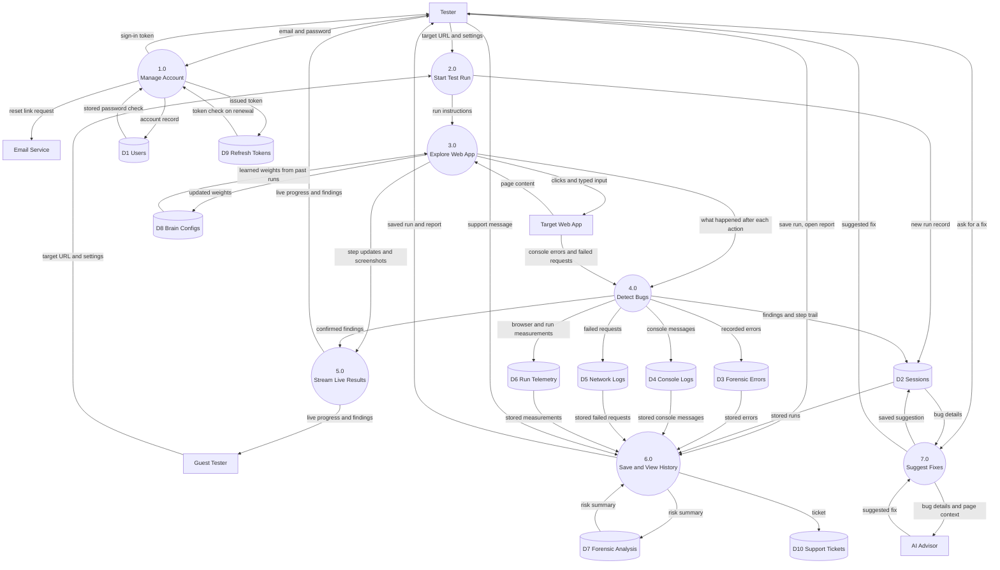

# Data Flow Diagram: Level 1

## What this shows

This diagram opens up the single BugSafari process from the context diagram and splits
it into the seven main processes the system actually performs. It also shows the ten
places where data is kept.

The external entities are the same ones from Level 0, so the two diagrams line up. Read
this one as the answer to "what happens inside BugSafari, and what does each part read
or write".

## Diagram

## Processes

| Process | What it does | Main source location |
| --- | --- | --- |
| 1.0 Manage Account | Registration, sign in, token renewal, password reset, profile and settings | `testing-core/src/presentation/authentication/` |
| 2.0 Start Test Run | Checks the target URL, reads the chosen attack types, creates the run and hands it to the engine | `testing-core/src/presentation/api/registerRoutes.ts`, route `POST /api/start-test` |
| 3.0 Explore Web App | The main loop: read the page, score elements, act, hash the new state, avoid repeats | `testing-core/src/domain/services/exploration/ExplorationLoop.ts` |
| 4.0 Detect Bugs | Turns raw browser signals into confirmed findings with a cause and a severity | `testing-core/src/bugs/finders/` |
| 5.0 Stream Live Results | Pushes each step, screenshot, console line and finding to the dashboard as it happens | `testing-core/src/infrastructure/socket/SocketTelemetryGateway.ts` |
| 6.0 Save and View History | Writes a finished run to storage and reads it back for the report screen | `testing-core/src/infrastructure/database/repositories/` |
| 7.0 Suggest Fixes | Sends one finding to the AI Advisor and stores the answer with that finding | `testing-core/src/infrastructure/ai/GeminiRemediationAdvisor.ts` |

## Data stores

| Store | Holds |
| --- | --- |
| D1 Users | Accounts, hashed passwords, personal settings |
| D2 Sessions | One record per test run, with its findings and step trail inside it |
| D3 Forensic Errors | Individual errors caught during a run, with type and severity |
| D4 Console Logs | Every console message printed by the tested page |
| D5 Network Logs | Requests that failed during the run |
| D6 Run Telemetry | Browser version, screen size, timings and counts for the run |
| D7 Forensic Analysis | The risk score and root cause summary calculated for a run |
| D8 Brain Configs | The scoring weights the engine learned, kept per user and per site |
| D9 Refresh Tokens | Long-lived sign-in tokens, so a session survives a page reload |
| D10 Support Tickets | Contact and feature request messages |

## Notes

Process 3.0 both reads and writes D8. It loads the weights learned on a previous run
against the same site before it starts, and writes the updated weights back as the run
goes on. This is what makes a second run on the same site smarter than the first.

Nothing is written to storage for a Guest Tester. Processes 3.0, 4.0 and 5.0 still run
in full, but 6.0 refuses to save, so a guest only ever sees the live stream.

Sending a finding to the AI Advisor in 7.0 is a manual action. It never happens on its
own during a run.
