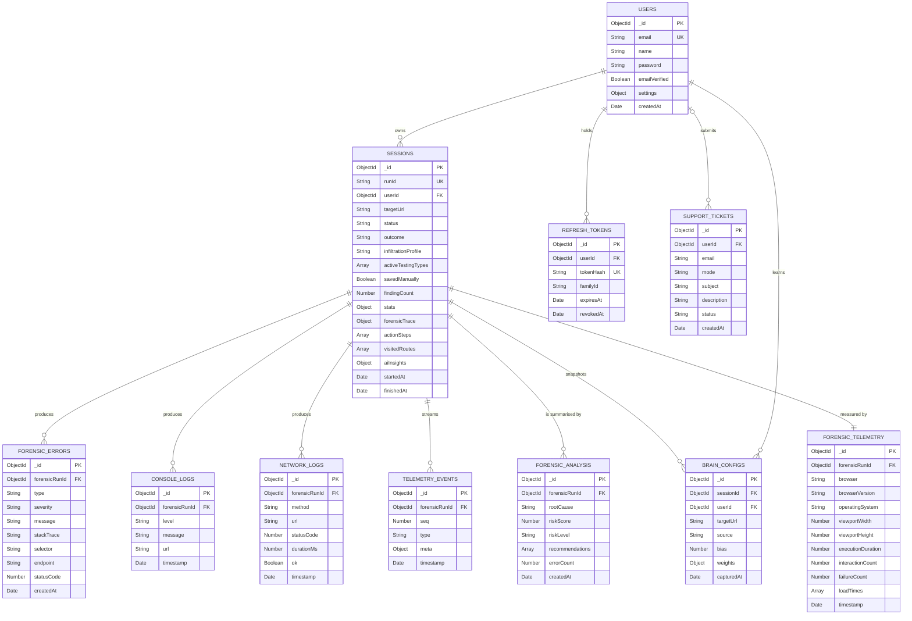

# Database Diagram

## What this shows

BugSafari stores its data in MongoDB across eleven collections. The diagram below
presents each collection, the fields that matter for understanding the system, and the
identifiers through which the collections refer to one another.

Only the fields needed to understand the design are listed. Several collections, the
sessions collection in particular, hold additional fields for counters, run settings and
cached results. Those are omitted so the diagram remains readable.

## Description of the database design

The database is organised around two central records. The first is the user, which
represents a registered operator of the system. The second is the session, which
represents a single automated test run. Every other record in the database is attached,
directly or indirectly, to one of these two.

Each record has its own unique identifier, written as `_id`, that the database assigns
automatically. Related records refer to one another by storing a copy of the parent
record's identifier. A session stores the identifier of the user who owns it, in a field
named `userId`. In this way the database always knows which operator a given run belongs
to.

The records produced during a run refer back to their session in the same manner. The
error, console, network, telemetry, analysis and event collections each store the
session's identifier in a field named `forensicRunId`, while the learned scoring
configurations store it in a field named `sessionId`. Because every such record carries
the identifier of its parent session, the system can gather all information belonging to a
single run by selecting the records whose stored identifier matches that run.

A user connects to many sessions, and a session connects to many supporting records. A
user owns any number of sessions, holds any number of sign-in tokens, accumulates a
history of learned scoring configurations, and may submit support tickets. A session, in
turn, produces the errors, console messages, network requests and telemetry events
captured while it ran, is described by one performance-and-environment telemetry summary,
is interpreted by a risk analysis, and records snapshots of the scoring configuration the
engine learned. The findings discovered during a run, together with the ordered trail of
actions the engine performed, are stored inside the session record itself rather than in
separate collections.

This arrangement lets the system organise information by run and retrieve it efficiently.
To display a report, the system first reads the session, which already contains the
findings and the action trail, and then reads the supporting collections by matching the
session identifier. Because the ownership identifier travels with every session and every
query includes it, one operator can never read another operator's runs, and all of a
run's related records can be located from a single identifier.

## Entity relationship diagram

## Collections

| Collection | Purpose | Key identifier |
| --- | --- | --- |
| users | Operator accounts and personal settings | `email` is unique; the password is stored as a bcrypt hash |
| sessions | One document per test run. Also holds the findings and the action trail inside it | `runId` is the short public code shown to the operator, for example `RUN-1A2B3C`; `userId` names the owner |
| forensic_errors | Each fault caught during a run, typed and graded by severity | `forensicRunId` points at the session |
| console_logs | Every console message printed by the tested page | `forensicRunId` |
| network_logs | Every network request made during the run, both successful and failed | `forensicRunId` |
| telemetry_events | The ordered stream of live events emitted during a run, kept so a reconnecting viewer can replay the run in order | `forensicRunId`, with `seq` giving the order |
| forensic_telemetry | Browser, screen size, duration and interaction counts. One document per run | `forensicRunId` |
| forensic_analysis | The risk score and root cause worked out from the recorded errors | `forensicRunId` |
| brain_configs | Snapshots of the scoring weights the engine learned | Looked up by `userId` together with `targetUrl` |
| refreshtokens | Long-lived sign-in tokens, stored as hashes | `familyId` groups a chain of renewals |
| support_tickets | Contact messages and feature requests | `userId` may be empty for a guest |

## Findings are stored inside the session

Findings do not have their own collection. Each session document has a `forensicTrace`
field, and inside it a `caughtBugs` array. Each entry in that array is one finding, with
its own message, severity, reproduction steps, and its own copy of the action steps that
led to it.

This is a deliberate choice. A finding is never read without its run, so keeping the two
together lets the report screen load from a single document instead of joining several
collections.

The same applies to `actionSteps` on the session, which is the run-wide list of what the
engine did. It is capped at sixty steps, and `visitedRoutes` is capped at five hundred, so
one long run cannot grow a document without limit.

## Retention

Unsaved runs are deleted automatically twenty four hours after they start. This is done
with an expiry index on `startedAt` that applies only to documents where `savedManually`
is false. When an operator saves a run, that flag becomes true and the document drops out
of the expiry rule, so saved history is kept indefinitely.

MongoDB does not delete child documents when a parent expires, so a background job runs
every hour, looks for supporting records whose session no longer exists, and removes them.
Deleting a run from the history screen removes its supporting records immediately.

## Separation between operators

Every session, learned weight and log is reachable only through the owning operator. The
session document requires a `userId`, and every query that reads or writes a session
includes that operator's identifier in the filter. The supporting collections carry no
operator identifier of their own, so a report request first looks up the session by its
identifier and owner, and only then reads the supporting records for that session.

Guest runs are never written to the database. Because a session cannot be created without
a user identifier, a guest run lives only in memory and on screen for as long as the
browser tab is open.
