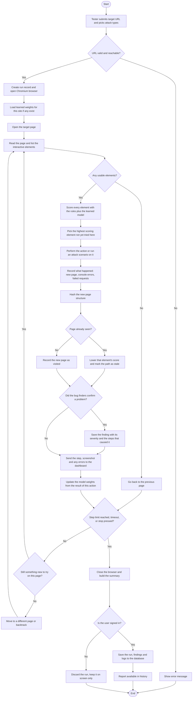
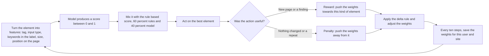

# System Flowchart

## What this shows

The first flowchart follows one complete test run from the moment the tester submits a
URL to the moment the report is either saved or dropped. The decision points in the
middle are the important part, because they are what separates BugSafari from a recorded
test script: the system decides at every step which element to touch, whether it has
already seen the page it landed on, and whether something went wrong.

The second flowchart isolates the learning loop, which is easier to follow on its own.

## Main run flowchart

## Learning loop flowchart

## Decision points explained

| Decision | Why it exists |
| --- | --- |
| URL valid and reachable | Blocks bad addresses and internal or private addresses before a browser is opened |
| Any usable elements | A page with nothing to click is a dead end, so the engine backs out instead of stalling |
| Page already seen | The structural hash catches loops. Without it the engine would keep clicking between the same two screens |
| Did the bug finders confirm a problem | Raw console noise is not a bug. A finding is only recorded when a finder can name the cause |
| Step limit, timeout, or stop | Three separate ways for a run to end, so it always terminates |
| Is the user signed in | Guests reach the same summary but nothing is written to the database |

## Notes on the learning step

The score used to pick an element is not purely learned. Sixty percent comes from fixed
rules about tags, input types and keywords in labels, and forty percent from the model.
This keeps early behaviour sensible before the model has seen anything, and lets the
model improve the ranking over time.

The weights are saved against both the user and the site address. A run against the same
site later starts with the weights from last time instead of starting over, and one
user's learned weights are never used for another user's run.
