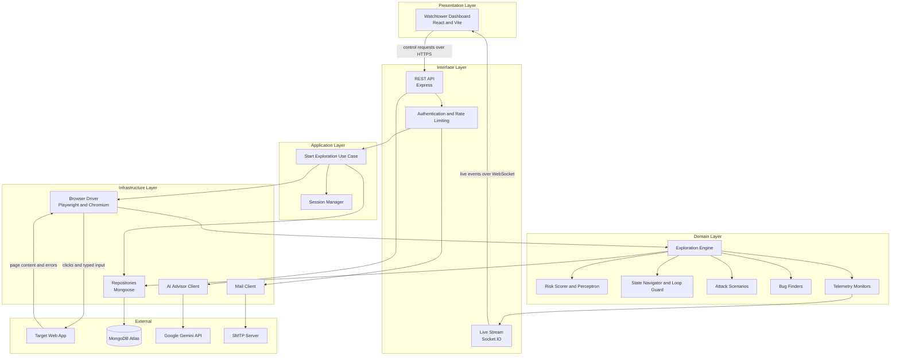

# System Architecture

## What this shows

BugSafari is built as one repository with three packages: the dashboard the tester uses,
the testing core that does the work, and a shared package that defines the data shapes
both sides agree on. This diagram groups the parts by layer and shows the two separate
channels between the dashboard and the backend.

The split into layers is not decoration. The exploration engine talks only to interfaces,
so the browser tool, the streaming transport and the database can each be replaced
without touching the engine.

## Architecture diagram

## The three packages

| Package | Runs on | Owns |
| --- | --- | --- |
| `developer-dashboard` | The tester's browser, port 5173 in development | The whole operator experience: sign in, starting a run, the live feed, history, reports and settings |
| `testing-core` | Node on the server, port 3000 | Everything else: the API, the exploration engine, the attack scenarios, the bug finders, telemetry and storage |
| `shared` | Both | The TypeScript types that describe telemetry events, findings, run settings and results, so neither side can drift from the other |

The dashboard never touches the database and never runs a browser. The testing core never
renders anything. The shared package has no dependencies at all, only type definitions.

## Two channels, on purpose

Control travels one way and results travel the other, over two different transports.

- **REST** carries the commands: start a run, stop a run, save the run, list history, open
  a report, ask for a fix suggestion. Each of these is a single request with a single
  answer, so a normal HTTP call is the right fit.
- **Socket.IO** carries the results: steps, screenshots, console messages, findings. These
  arrive continuously while the run is going, and the tester needs to see them as they
  happen, so the server pushes them instead of waiting to be asked.

Keeping the two apart means a dropped socket connection does not stop the run. The
dashboard reconnects, sends a request to reattach to the run it was watching, and picks
the stream back up.

### Events the dashboard listens for

| Event | Carries |
| --- | --- |
| `telemetry` | One step of the run: what was clicked, what happened, any diagnosis |
| `live-frame` | A JPEG screenshot of the browser, about fifteen per second |
| `browser-console` | A console message printed by the tested page |
| `incident-report` | One confirmed finding |
| `forensic-report` | The full summary when a run finishes |
| `url-changed` | The tested page navigated somewhere new |
| `session-snapshot` | The current state of a run, sent when the dashboard reattaches |
| `time-sync` | Server clock reference, so the on screen timer stays correct |

The dashboard sends `session-attach`, `pause-test`, `resume-test` and `stop-test` back on
the same connection.

## Main API routes

| Method and path | Purpose |
| --- | --- |
| `POST /api/start-test` | Start a run on a target URL |
| `POST /api/safari/stop` | Stop the caller's current run |
| `GET /api/session/active` | Get the state of the caller's live run, used after a page reload |
| `POST /api/history/save-session` | Save the finished run to history |
| `GET /api/history/sessions` | List the caller's saved runs, paged |
| `GET /api/forensic/report/:sessionId` | Read one full report |
| `POST /api/findings/suggest-fix` | Ask the AI Advisor about one finding |
| `DELETE /api/history/:id` | Delete a saved run and everything attached to it |
| `GET /api/health` | Liveness check used by the deployment |

Account routes sit alongside these: register, login, refresh, logout, forgot password and
reset password, plus profile and settings.

## A note on running several tests at once

One test run means one Chromium browser, which is heavy. To let more than one tester run
a test at the same time, the deployed system puts incoming run requests on a Redis job
queue and runs them in separate worker processes, one run per worker.

The engine code is exactly the same in both cases. The worker builds the same objects the
API process would have built and calls the same use case. The queue only decides where
the run happens, so the diagram above holds either way.
