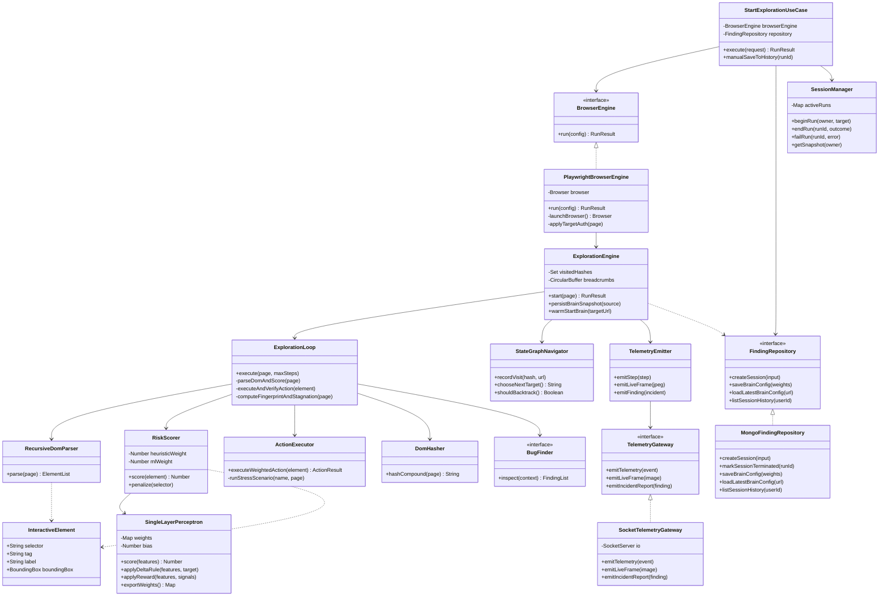
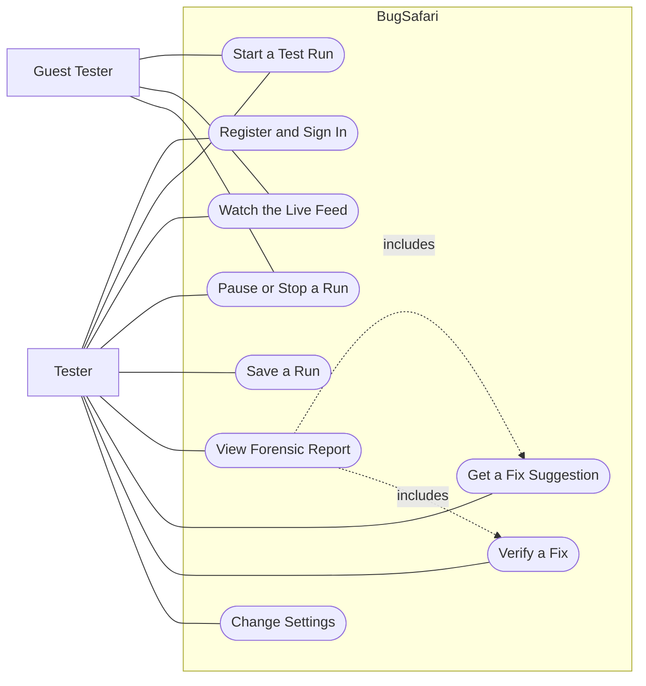

# UML Diagrams

## What this showsss

Two diagrams. The first is a class diagram of the main backend classes that carry out a
test run, with the methods that connect them. The second is a use case diagram showing
what each kind of user is allowed to do.

The class diagram is kept at design level. It shows the classes that matter to the
system's behaviour and the few methods that pass work between them, not every field and
helper in the code.

## Class diagram

### How to read it

| Class | Responsibility |
| --- | --- |
| StartExplorationUseCase | The entry point for a run. Checks the request, sets up the engine, and settles the run when it ends |
| SessionManager | Keeps track of which runs are currently active and who owns each one |
| PlaywrightBrowserEngine | Opens a real Chromium browser and hands the page to the engine |
| ExplorationEngine | Owns the run state: pages already seen, the last twenty actions, and the learned weights |
| ExplorationLoop | Runs one step at a time: read the page, score, act, check the result, hash the new state |
| RecursiveDomParser | Walks the page and returns the elements a user could interact with |
| RiskScorer | Ranks those elements. Mixes fixed rules with the learned model, weighted 60 to 40 |
| SingleLayerPerceptron | The learning part. Scores a feature vector and updates its weights with the delta rule |
| ActionExecutor | Performs the chosen action, or runs an attack scenario such as form bypass or data fuzzing |
| DomHasher | Turns the page structure into a short hash so repeats can be spotted |
| StateGraphNavigator | Decides where to go next and when to backtrack |
| TelemetryEmitter | Formats what just happened and pushes it out to the dashboard |
| MongoFindingRepository | The only class that writes runs and learned weights to the database |

The three interfaces on the left keep the engine independent of the tools around it. The
engine talks to `BrowserEngine`, `TelemetryGateway` and `FindingRepository`, not to
Playwright, Socket.IO or MongoDB directly.

## Use case diagram

### Actor permissions

| Use case | Tester | Guest Tester |
| --- | --- | --- |
| Register and Sign In | Yes | No |
| Start a Test Run | Yes | Yes |
| Watch the Live Feed | Yes | Yes |
| Pause or Stop a Run | Yes | Yes |
| Save a Run | Yes | No |
| View Forensic Report | Yes | No |
| Get a Fix Suggestion | Yes | No |
| Verify a Fix | Yes | No |
| Change Settings | Yes | Local only, not stored |

A guest can do the testing but not the keeping. The system enforces this in two places:
the save route rejects a request without a signed-in user, and the dashboard sends a
guest back to the main screen if they try to open the history pages.

Fix suggestion and fix verification are drawn as included in the report use case because
both are started from inside a saved report, using one selected finding.
